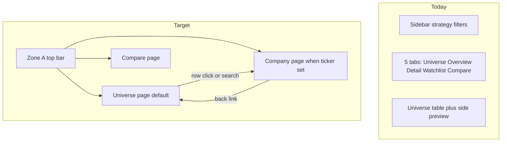

# Finqube-Style UI Overhaul Plan

## Goal

Replace the current price-scanner dashboard (5 top tabs + sidebar controls + split universe panel) with a Finqube-like layout:

```text
Zone A — App shell (top bar)
Zone B — Company hero OR scan summary strip
Zone C — Score strip (company page only)
Zone D — Section nav (horizontal tabs)
Zone E — Card grid content
```

Reference layout from wireframes; visual target: [Finqube AAPL overview](https://finqube.io/company-overview/AAPL/US/).

**Rollout:** Complete replacement of price-scanner UI (no parallel old tabs). Lynch scanner keeps its existing [`viz/pages/lynch.py`](src/quant_platform/viz/pages/lynch.py) page set unchanged in this pass.

---

## Current vs target navigation



| Old surface | New home |
|-------------|----------|
| Full Universe + split preview | **Universe page** (table only, row → company) |
| Ticker Detail | **Company page** (Zones B–E) |
| Overview charts | Collapsible **Scan insights** section on Universe page |
| Actionable Watchlist | Universe filter preset `actionable_only` |
| Compare | **Compare page** (unchanged logic, new card layout) |
| Sidebar strategy/report | **App shell** top bar |
| Sidebar filters | **Universe filter bar** (horizontal) |

Query param bridge already exists: [`viz/shared/navigation.py`](src/quant_platform/viz/shared/navigation.py) (`?ticker=NVDA`). Extend with `view=compare` if needed.

---

## Architecture

### New module layout

Add a dedicated layout package to avoid bloating [`components.py`](src/quant_platform/viz/shared/components.py) (~490 lines):

```text
src/quant_platform/viz/
├── layout/
│   ├── __init__.py
│   ├── shell.py          # Zone A — top bar
│   ├── company.py        # Zones B–E — company profile page
│   ├── universe.py       # Universe page (scan strip + filters + table)
│   ├── compare.py        # Compare page wrapper
│   └── cards.py          # Reusable HTML card builders
├── shared/
│   ├── styles.py         # Design tokens + Finqube CSS (expand)
│   ├── components.py     # Keep charts + data helpers; delegate layout out
│   └── navigation.py     # Extend: back link, view routing
├── pages/
│   └── price_scanner.py  # Thin router: shell + page dispatch
└── dashboard.py            # Entry: page_set price → new router
```

### Design tokens ([`viz/shared/styles.py`](src/quant_platform/viz/shared/styles.py))

Add CSS classes (HTML via `st.markdown(unsafe_allow_html=True)`):

| Class | Purpose |
|-------|---------|
| `.app-shell` | Sticky top bar, 56px, white, bottom border |
| `.company-hero` | Zone B full-width card |
| `.score-strip` / `.score-composite` / `.score-pill` | Zone C |
| `.section-nav` | Zone D underline tabs (hide default Streamlit tab chrome where possible) |
| `.layout-card` | Zone E white card, 12px radius, subtle shadow |
| `.scan-summary-strip` | Universe page regime + tier counts |
| `.filter-bar` | Horizontal filter row |

Also update [`PLOTLY_LAYOUT`](src/quant_platform/viz/shared/styles.py): lighter grid, `#f9fafb` plot bg, muted axes — match Finqube financial aesthetic.

Hide Streamlit chrome where safe: `#MainMenu`, footer, reduce `.block-container` top padding.

---

## Page specs

### 1. App shell — Zone A ([`layout/shell.py`](src/quant_platform/viz/layout/shell.py))

```text
[QP] Quant Platform   [Search ticker…]   Breakout ▾   Report ▾   Universe | Compare
```

- **Strategy select** — from [`list_viz_strategies()`](src/quant_platform/viz/strategy/registry.py) (price strategies only in shell)
- **Report select** — from [`list_report_paths()`](src/quant_platform/viz/strategy/reports.py)
- **Ticker search** — text input; on submit → `set_detail_ticker()` → company page
- **Nav links** — Universe (clear `?ticker`), Compare (`view=compare`)
- **Settings gear** — expander: sync DuckDB, report path override (move from sidebar)

Replace [`render_strategy_sidebar()`](src/quant_platform/viz/sidebar.py) for price page_set. Set `initial_sidebar_state="collapsed"` in [`dashboard.py`](src/quant_platform/dashboard.py).

---

### 2. Company page — Zones B–E ([`layout/company.py`](src/quant_platform/viz/layout/company.py))

Entry: `?ticker=SYMBOL` set via [`sync_detail_ticker()`](src/quant_platform/viz/shared/navigation.py).

**Zone B — Hero** (`render_company_hero`)
- Left: ticker + company name (from `fetch_ticker_snapshot`)
- Right: tier badge + strategy badge ([`tier_badge_html`](src/quant_platform/viz/shared/components.py))
- Row: live price, day change, market cap, sector ETF, 1Y change, scan date
- Banner: `tier_reason` or filter reason

**Zone C — Score strip** (`render_score_strip`)
- Composite box: `final_adjusted_score`, regime multiplier
- Pills from `config.score_component_keys` + [`scores_to_dataframe()`](src/quant_platform/viz/strategy/reports.py)
- Swing: 4 pills; Breakout: 9 pills (wrap 2 rows on narrow width via CSS grid)

**Zone D — Section tabs**
- Sprint tabs: **Summary | Technical | News**
- Use `st.tabs` styled via `.section-nav` CSS overlay

**Zone E — Tab content**

| Tab | Content | Reuse |
|-----|---------|-------|
| Summary | 2-col: radar + universe context card; full-width key insight card | `render_radar()`, new `render_universe_context()`, new `render_key_insight()` |
| Technical | Full-width bar chart; 2×2 factor detail cards | `render_score_bars()`, `_render_score_cards()` |
| News | Compact live strip + news feed cards | `render_ticker_news_panel()` split into two functions |

**Back link:** `← Back to Universe` clears ticker query param.

Refactor [`render_ticker_detail()`](src/quant_platform/viz/shared/components.py) into thin wrapper calling `layout/company.py` (keep old function as deprecated alias for tests).

---

### 3. Universe page ([`layout/universe.py`](src/quant_platform/viz/layout/universe.py))

Default when no `?ticker` and not compare view.

```text
Scan summary strip (regime + tier counts)
Filter bar (tier, min score, eligible, actionable, search)
Universe table (clickable rows → company page)
Optional: Scan insights expander (tier pie, histogram — from old Overview)
```

- Remove split preview column from [`render_all_tickers_tab()`](src/quant_platform/viz/pages/price_scanner.py) (lines 132–166)
- Row click → `set_detail_ticker(symbol)` + rerun
- Reuse [`apply_universe_controls()`](src/quant_platform/viz/shared/universe_panel.py), [`universe_table_column_config()`](src/quant_platform/viz/shared/universe_panel.py)
- Watchlist logic → filter bar toggle "Actionable only" using `config.actionable_tiers`

---

### 4. Compare page ([`layout/compare.py`](src/quant_platform/viz/layout/compare.py))

Wrap existing [`render_compare_tab()`](src/quant_platform/viz/pages/price_scanner.py) logic in `.layout-card` grid. No functional change to radar/compare logic.

---

### 5. Dashboard router ([`dashboard.py`](src/quant_platform/dashboard.py))

Replace price branch tab loop with:

```python
render_app_shell(...)  # Zone A
view = resolve_view()  # universe | company | compare

if view == "company" and detail_ticker:
    render_company_page(ticker, ticker_data, config, df, tickers)
elif view == "compare":
    render_compare_page(...)
else:
    render_universe_page(config, df, tickers, filters, summary, regime)
```

Remove: `render_price_header`, 5-tab structure, sidebar ticker picker for price page_set.

---

## Helper functions to add

| Function | File | Logic |
|----------|------|-------|
| `render_universe_context()` | `layout/cards.py` | Percentile of `final_score` vs eligible universe; tier count |
| `render_key_insight()` | `layout/cards.py` | Top 2 factors by score/max; penalty flags from report if present |
| `resolve_view()` | `navigation.py` | `compare` if query param; `company` if ticker; else `universe` |
| `render_breadcrumb()` | `layout/shell.py` | Back link + scan date |

---

## Data contract (no backend changes)

All layout reads existing JSON report shape from [`load_scan_report()`](src/quant_platform/viz/strategy/reports.py). No engine/scoring changes required.

Uses:
- `ticker_data.summary.final_adjusted_score`
- `ticker_data.scores.{key}.score / max / meaning`
- `config.score_component_keys` from [`VizStrategyConfig`](src/quant_platform/viz/strategy/registry.py)
- Live snapshot via existing cached `_load_ticker_snapshot()` in components

---

## Testing

Add/update unit tests (no Streamlit e2e required):

| Test file | Coverage |
|-----------|----------|
| [`tests/unit/test_viz_display.py`](tests/unit/test_viz_display.py) | Card HTML helpers, score pill rendering |
| New `tests/unit/test_viz_layout.py` | `render_key_insight()` factor ranking, `render_universe_context()` percentile |
| [`tests/unit/test_viz_strategy.py`](tests/unit/test_viz_strategy.py) | Ensure breakout/swing keys still map to pill labels |

Manual QA checklist:
- Universe → click row → company page with hero + pills
- Search ticker in shell → company page
- Back link → universe
- Breakout 9 pills and Swing 4 pills render correctly
- Compare page still works
- Lynch page unchanged

---

## Implementation order

```text
Step 1  styles.py design tokens + CSS classes
Step 2  layout/cards.py HTML builders
Step 3  layout/company.py Zones B–E (core Finqube feel)
Step 4  layout/universe.py + remove split panel
Step 5  layout/shell.py + navigation extensions
Step 6  dashboard.py + price_scanner.py router rewrite
Step 7  layout/compare.py card wrapper
Step 8  Tests + manual QA on quant-view
```

---

## Out of scope (follow-on)

- Lynch Finqube layout (keep current lynch pages)
- Plotly gauge for composite score (use bold number first)
- Fundamentals / Eligibility / History tabs on company page (Phase 2 tabs)
- Mobile-specific hamburger nav
- Dark mode

---

## Success criteria

1. Price dashboard no longer shows old 5-tab layout or sidebar-heavy controls
2. Company page matches wireframe zones B–E for both Breakout and Swing
3. Universe page is default landing; table row opens company profile
4. Top app shell handles strategy, report, search, and nav
5. Lynch scanner still loads and works unchanged
6. Unit tests pass; no changes to scan engine or report JSON schema
